# Задача 1. Базові SELECT
Вивести всіх студентів, які зареєструвалися після 2024‑01‑01.
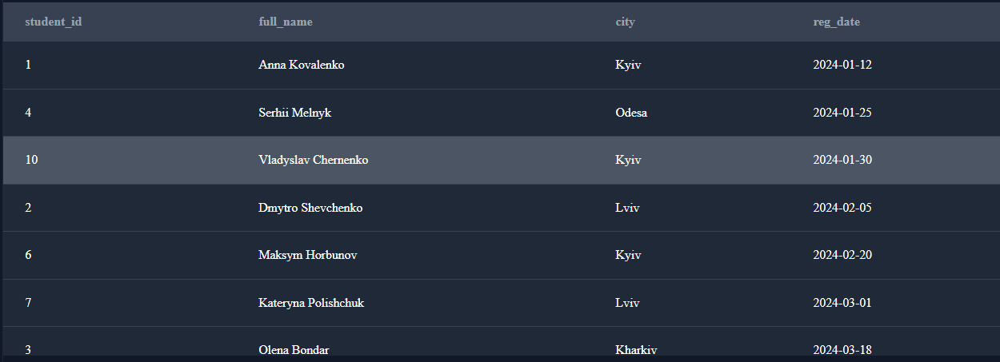
Вивести всі курси категорії "Data Science".
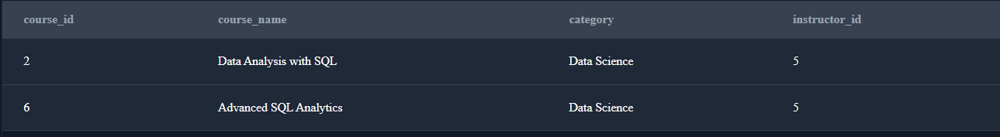

# Задача 2. Групування та агрегація
Порахувати кількість студентів у кожному місті.
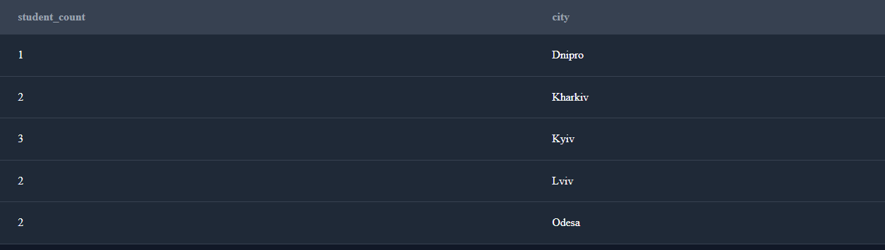
Порахувати кількість курсів у кожній категорії.
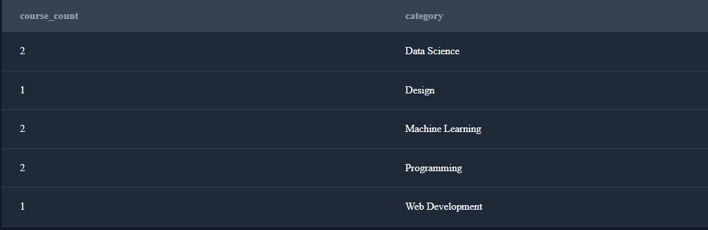
Порахувати середню оцінку по кожному курсу.
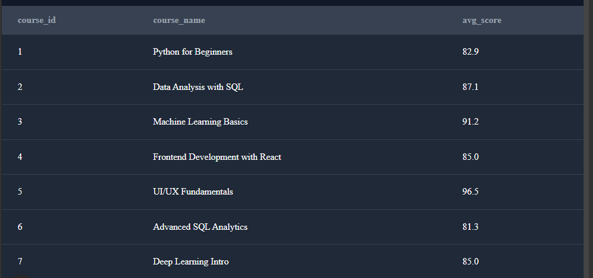

# Задача 3. JOIN‑аналіз
Вивести список курсів разом з іменами викладачів.
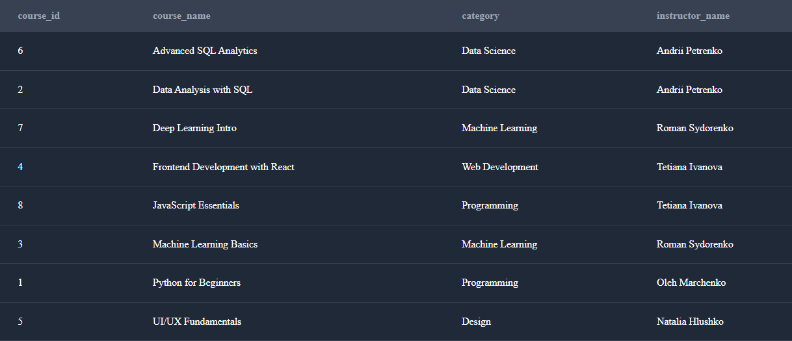
Вивести студентів та назви курсів, на які вони записані.
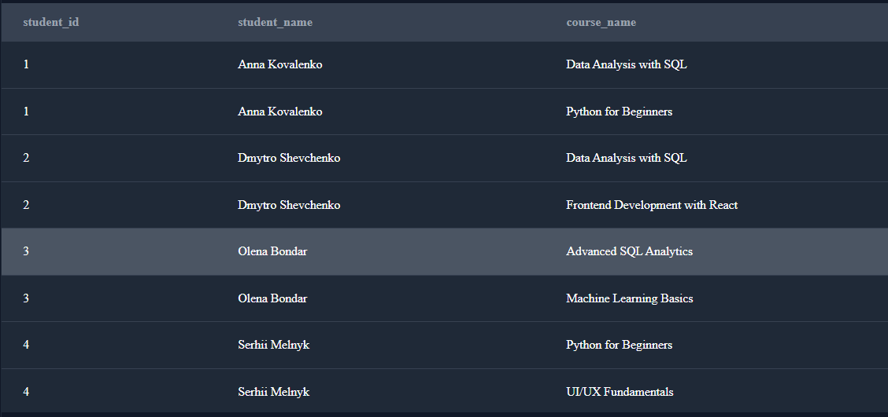
Порахувати, скільки студентів у кожного викладача.

# Задача 4. Аналітика прогресу
Порахувати середню оцінку кожного студента.
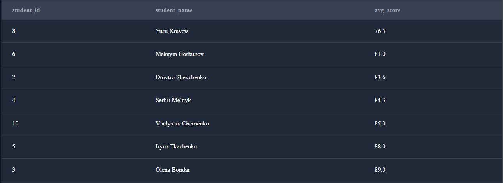
Порахувати відсоток завершених уроків для кожного курсу.
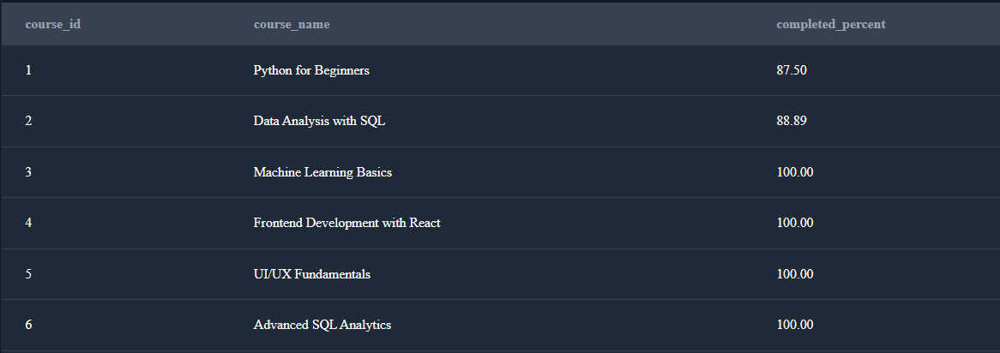
Знайти студентів, які завершили всі уроки у своїх курсах.
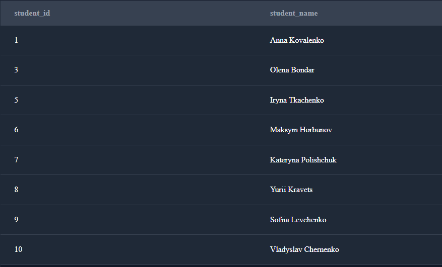

# Задача 5. Віконні функції
Для кожного курсу визначити рейтинг студентів за середнім балом.
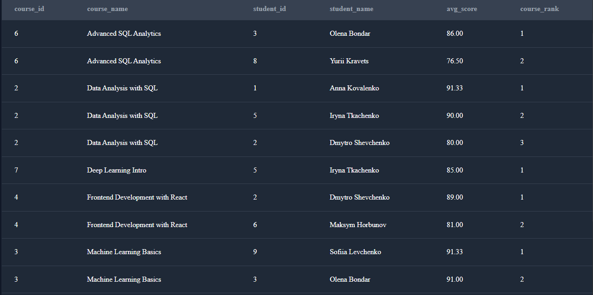
Порахувати кумулятивну кількість уроків, завершених студентом у хронологічному порядку.
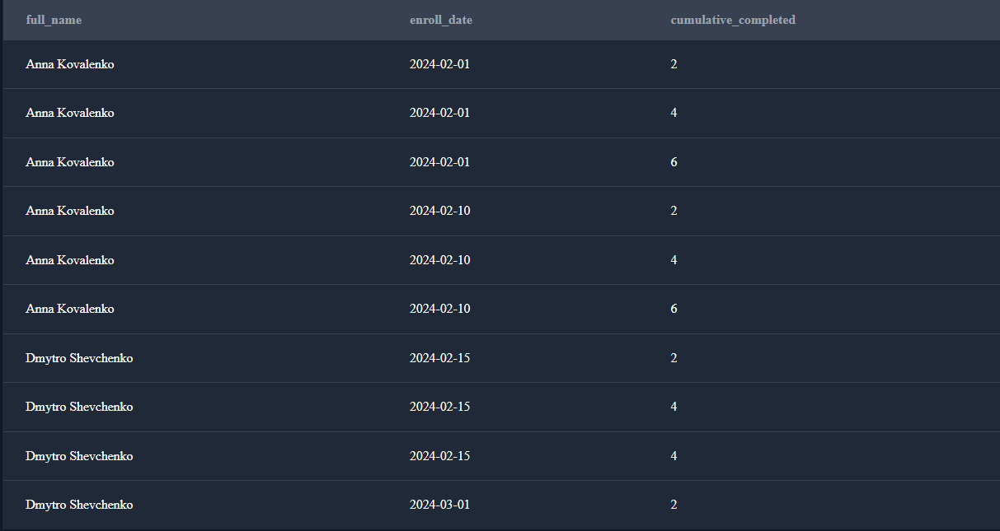
Для кожної категорії курсів знайти топ‑1 курс за кількістю студентів.
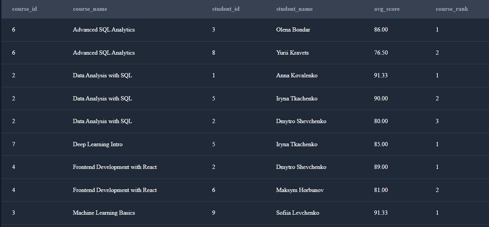

# Висновки

У межах цього проєкту було створено та проаналізовано реляційну базу даних для онлайн-платформи навчання. Реалізована структура БД охоплює основні елементи освітнього процесу: студентів, викладачів, курси, зарахування та прогрес навчання.

## Основні результати

### 1. Проєктування бази даних
- Спроєктовано нормалізовану схему з таблицями `students`, `instructors`, `courses`, `enrollments`, `progress`.
- Реалізовано логічні зв’язки між таблицями за допомогою первинних та зовнішніх ключів.
- Забезпечено цілісність і узгодженість даних.

### 2. Базові SELECT-запити
- Отримано список студентів, які зареєструвалися після визначеної дати.
- Виведено курси за заданою категорією.
- Продемонстровано використання фільтрації та сортування даних.

### 3. Групування та агрегація
- Пораховано кількість студентів у кожному місті.
- Визначено кількість курсів у кожній категорії.
- Обчислено середню оцінку для кожного курсу, що дозволяє оцінити загальний рівень успішності.

### 4. JOIN-аналіз
- Реалізовано запити з об’єднанням кількох таблиць (`JOIN`).
- Отримано:
  - список курсів разом з іменами викладачів;
  - перелік студентів та курсів, на які вони записані;
  - кількість студентів у кожного викладача.

### 5. Аналітика прогресу студентів
- Розраховано середній бал кожного студента.
- Визначено відсоток завершених уроків для кожного курсу.
- Знайдено студентів, які завершили всі уроки у своїх курсах.

### 6. Віконні функції
- Побудовано рейтинг студентів у межах кожного курсу за середнім балом.
- Реалізовано кумулятивний підрахунок завершених уроків у хронологічному порядку.
- Продемонстровано можливості аналітичних SQL-запитів для поглибленого аналізу даних.

## Загальний висновок

Проєкт демонструє практичне застосування SQL для:
- проєктування реляційних баз даних;
- написання складних аналітичних запитів;
- використання агрегатних та віконних функцій;
- аналізу навчального прогресу та ефективності курсів.

Отримана база даних може бути використана як основа для подальшого розвитку онлайн-платформи навчання, зокрема для створення звітів, аналітичних панелей та розширення функціональності системи.
